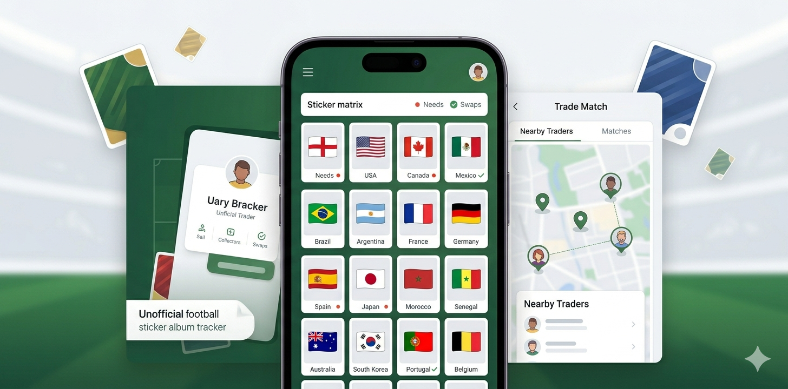

# World Cup Sticker Tracker

Free unofficial mobile-first sticker tracker app for the 2026 World Cup album. It helps football sticker collectors track needs, swaps, duplicate stickers, saved trades, JSON backups, and shareable matrix images for Panini-style sticker album swaps.

This is an unofficial fan-made collector tool and is not affiliated with FIFA, Panini, or any official tournament or sticker album brand.

## Live app
Open the app here:

https://mipa509.github.io/world-cup-sticker-tracker/

On iPhone, open the link in Safari and use Share > Add to Home Screen for the best app-like experience.

## What it does
- Track owned, needed, and swap stickers for all 48 World Cup 2026 teams, including multiple spare copies of the same sticker.
- Use it as a World Cup sticker album app for quick collecting, swaps, and trade checks on mobile.
- Use the matrix grid for a quick album overview.
- Export the matrix as a PNG for sharing in chats or Facebook groups.
- Export/copy your current swap list.
- Match trades quickly by pasting another person's needs and optional swaps into separate boxes.
- Save proposed trades so agreed swaps are reserved automatically.
- Optionally publish a trader profile to find nearby sticker matches through Supabase.

## Trade workflow
Paste another collector's list into `Their needs` to instantly see which of your swaps you can offer. If they also share a swap list, paste it into `Their swaps` to see what helps your album and to build a balanced proposal. The quick team picker still works for adding individual stickers by tap.

When you click `Save Trade`, the stickers you are giving are reserved. Reserved stickers no longer appear in your available swap list or future trade matches, so the next person only sees what is still available.

If the trade is accepted, click `Complete` on the saved trade. The app removes those outgoing swaps from your spare pool, marks the incoming stickers as owned, and keeps the trade as completed history. Deleting a reserved trade cancels it and releases the swaps; deleting a completed trade only removes the history entry.

Saved trades can be copied, loaded back into the matcher while reserved, completed, deleted, and included in JSON backups.

## Trader directory
The nearby trader directory is opt-in. Your browser album remains the source of truth; clicking `Publish Profile` sends a snapshot of your current needs and available swaps to Supabase. Reserved swaps are excluded from the published snapshot.

Location is rounded in the browser before it is saved. You can use browser location or type a town, postcode, city, or country; typed areas are looked up through OpenStreetMap Nominatim and then stored as approximate latitude/longitude plus your area label. Contact details are stored separately and are revealed only when another signed-in user has at least one sticker match with your profile.

The directory does not include in-app chat. `Offer Trade` saves a balanced trade locally, copies a message, and opens the external contact channel when possible.

## Can other people use it?
Yes. Anyone can open the public app link and track their own album.

Each person's main album data stays in their own browser using `localStorage`. The app does not upload full collections to GitHub. If someone opts into Nearby Traders, the app publishes only their display name, status, approximate area, current needs, available swaps, and contact detail to Supabase.

Nearby Traders protects contact details separately from public profile rows. Other signed-in users can see a matched profile through the directory, but the database only reveals contact details when both users have active published profiles with at least one sticker match.

That means:

- Your collection is separate from everyone else's collection.
- A friend can use the same public link and have their own data on their own phone.
- If someone clears Safari/browser data, their saved collection may be removed.
- To back up or move phones, use `Export` to save a JSON file, then `Import` it later.
- JSON backups include your album state and any saved trade proposals.

## Project notes
This is a static web app. The local album tracker works from the browser, and the optional Nearby Traders directory uses a small Supabase backend for login, published profiles, and contact reveal rules.

Maintainer setup and deployment notes live in [docs/deployment.md](docs/deployment.md).
